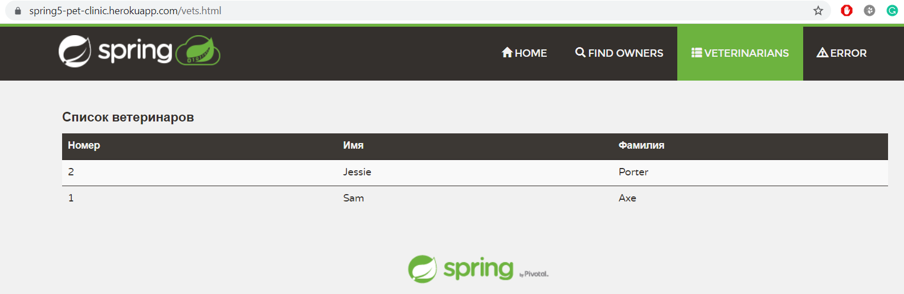

# Spring Pet Clinic

The Spring Pet clinic is a sample application designed to show how the Spring stack can be used to build simple, but powerful database-oriented applications.
Part of the course [Spring Framework 5: Beginner to Guru](https://www.udemy.com/course/spring-framework-5-beginner-to-guru/).
My personal implementation of the famous [Spring Pet Clinic](https://github.com/spring-projects/spring-petclinic) project.
I used web templates from the original project for a nice appearance.

## About the application
- **CI/CD** automatically runs tests on **CircleCI** after commit. The current status is 
- Automatically deploys to Heroku. You can [Run the application](https://spring5-pet-clinic.herokuapp.com/)
- IntelliJ IDEA was used as IDE and for work with Git

## Application features
- Store lists of Pets, Owners, and Vets in the database
- Plan Visits of Owners to the clinic
- Display this data in a browser
- Ability to run the application in any environment

## Used technologies
- **Java 11** as the main programming language
- **Spring Boot** to set up initial dependencies and to use different profiles
- **Spring Web MVC** to implement Model-View-Controller architecture
- **Spring Data JPA** to easily implement JPA based repositories
- **Hibernate** to map Java POJO's to database tables
- **H2 Database** to store data in-memory
- **CRUD repositories** to read and modify data
- **Commands and converters** to convert data for the presentation layer
- **Maven** to manage dependencies for builds
- **Thymeleaf** to build dynamic pages using templates written in HTML
- **Bootstrap 5** for HTML, CSS and JS templates
- **Lombok** to reduce boilerplate code
- **JUnit 5** and **Mockito** for unit and integration tests
- **Profiles** for using different data services and for i18n
- **Multi-module** Maven project to separate web and data levels
- **Wro4j** plugin to reduce web application page loading time